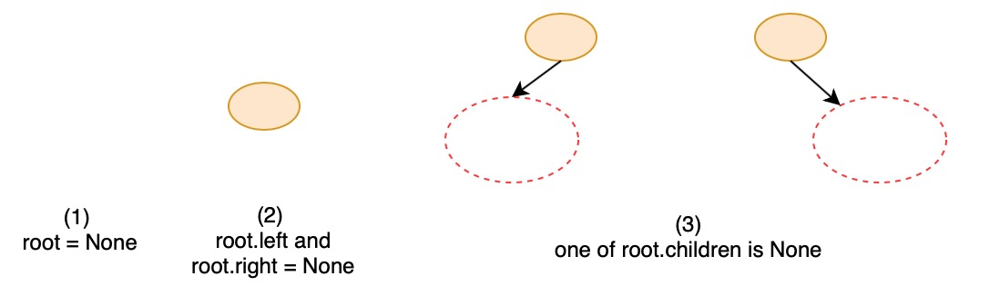

# 111. Minimum Depth of Binary Tree


This must be recursive problem, I sovled it in DFS.

The key is to think about the edge case and regular case.






```python
# Definition for a binary tree node.
# class TreeNode:
#     def __init__(self, val=0, left=None, right=None):
#         self.val = val
#         self.left = left
#         self.right = right
class Solution:
    def minDepth(self, root: TreeNode) -> int:
        # edge case
        if root == None:
            return 0
        elif root.left == None and root.right == None:
            return 1
        
        # regular case
        if root.left != None and root.right != None:
            min_left = self.minDepth(root.left)
            min_right = self.minDepth(root.right)
            minDepth = min(min_left, min_right) + 1
        elif root.left != None:
            minDepth = self.minDepth(root.left) + 1
        elif root.right != None:
            minDepth = self.minDepth(root.right) + 1
        
        return minDepth
```







Time complexity = $$O(n)$$ , space complexity = $$O(1)$$ . Because every node is traversalled and ervery node only stores its minimun depth.

