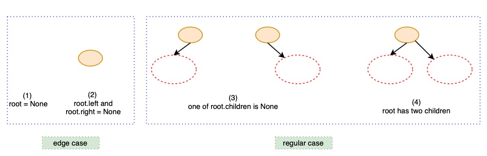

# 112. Path Sum


Think about edge case and regular case. 自上而下计算更省时间






```python
# Definition for a binary tree node.
# class TreeNode:
#     def __init__(self, val=0, left=None, right=None):
#         self.val = val
#         self.left = left
#         self.right = right
class Solution:
    def hasPathSum(self, root: TreeNode, sum: int) -> bool:
        # edge case
        if root == None:
            return False
        if root.left == None and root.right == None:
            if root.val == sum:
                return True
            else:
                return False
        
        # regular case
        left = self.hasPathSum(root.left, sum - root.val)
        right = self.hasPathSum(root.right, sum - root.val)
        if left == False and right == False:
            return False
        else:
            return True
```







Time complexity = $$O(n)$$ , space complexity = $$O(1)$$ . Because the worst case is to traversal all nodes and each node only bring one information `True` or `False`.

