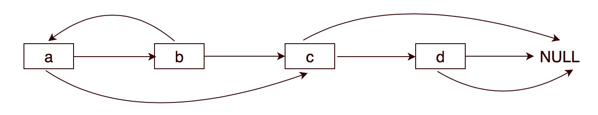
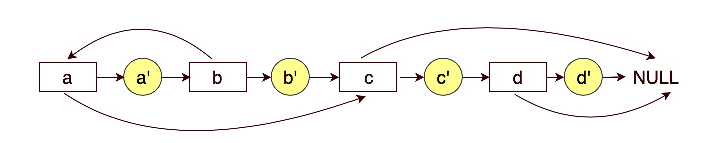
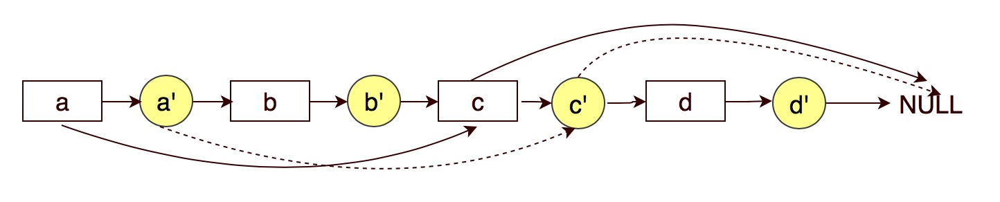
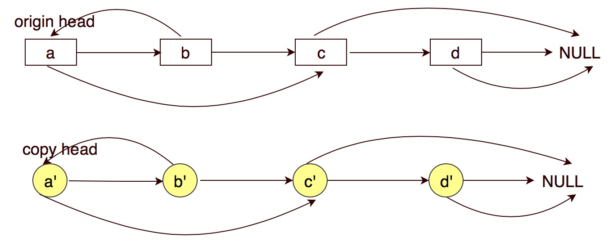

# 138. Copy List with Random Pointer


### Key idea: insert copy of each node into original list

### 核心： 把每个点的副本插入原始的list


### Solution:

1. copy next
2. copy random
3. split origin and copy


Don't modify original list when finish copy


