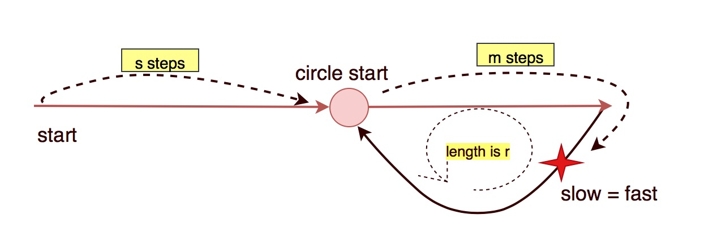

# 142. Linked List Cycle II


Assume `fast` goes `2k` steps and `slow` goes `k` steps, then they meet. Assume slow goes $$k=s+m+ar$$steps, fast goes $$2k=s+m+br$$ steps, $$a > b$$ . 

So in math, $$2k=2(s+m+ar)=s+m+br$$ 

Obviously, $$s+m =nr, s = nr-m$$ 

Assume $$n=1, s = r-m$$ \(why assume `n=1`\)

Let `slow` continues moving and `start` move at the same time at the same step until they meet. The steps `start` walks is the circle meeting.



Initialise`fast = head` and `slow = head`. After they move then compare them.


