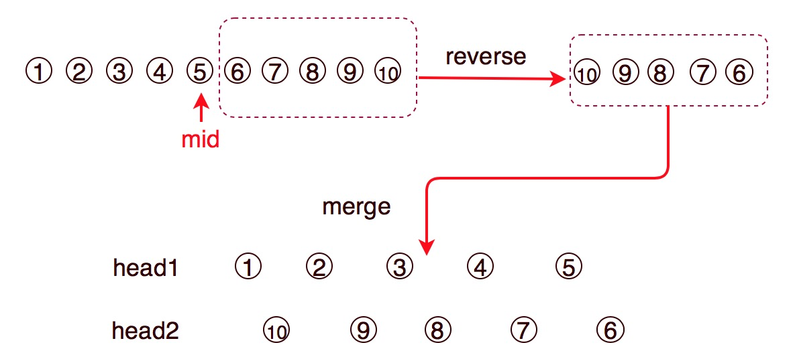

# 143. Reorder List


### Key idea: find middle + reverse latter part + merge

### 核心： 找到中间元素 ＋ 反转后半部分 ＋ 插入合并



* When searching middle node,  `faster = head.next`, `slow = head`. Pay attention to even or odd cases, which node should be middle node.
* When merging two list, should record `head1.next` and `head2.next` respectively before doing insertion.
* The condition of finishing insertion is both of head.next are null.
* 当寻找中间点时，注意list长度是基数还是偶数时，中间点应该是哪个
* 当合并两部分时，应先分别保留两个list的下一个节点，然后再插入元素
* 合并完成的条件是两个list的当前指针的下一个节点都为空


