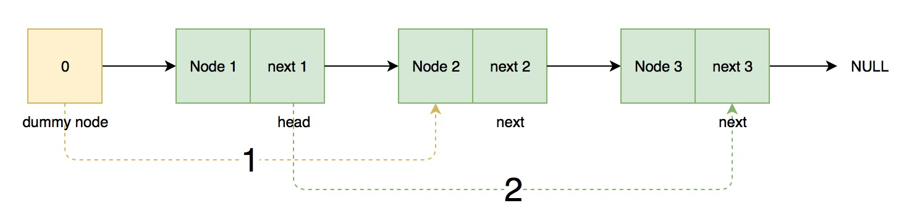

# 203. Remove Linked List Elements


### Key idea: A dummy node + pre-node

### 核心： 一个虚拟节点＋记录当前节点的前一个节点


### Solution 

ssume a dummy node is before the head node, then don't need to consider the case `head.val == value` individually. So there is only one case: `prehead.next = prehead.next.next`. Return `dummy.next` as the head of the linked list. `Dummy.next` records the real head of linked list, `head` records the node visiting, `prehead` records the pre-node of head.

我们自己假设在头节点前有个虚拟起始节点，则上述两种情况可以合并成普通的一种情况。需要三个参数，dummy.next记录真正的头节点，head记录当前正在访问的节点，prehead记录当前访问的前一个节点。

