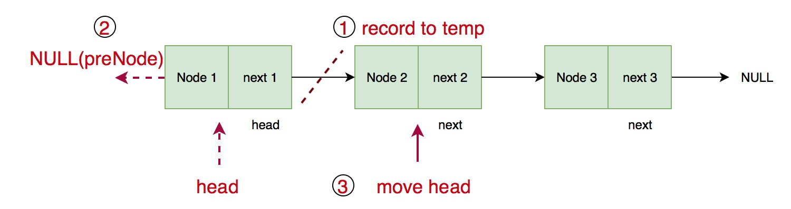

# 206. Reverse Linked List


### Key idea: record pre-node + current node + change next direction

### 核心： 记录前一个节点 ＋ 记录当前节点 ＋ 改变指针方向 


### Solution

`temp` records next node, `head` is current node, `preNode` is the pre-node of `head`. Don't forget to initialise `preNode = NULL`, return new head.

`temp` 记录下一个节点，`head`表示当前节点，`preNode`表示`head`的母节点。必须初始化`preNode=NULL`，并且最后返回新的头节点（即最后一个节点）。

1. record next node temporally
2. let head.next point to preNode
3. move to next node
4. 暂时记录下一个节点
5. 让head.next指向前一个节点
6. 指针后移一位

