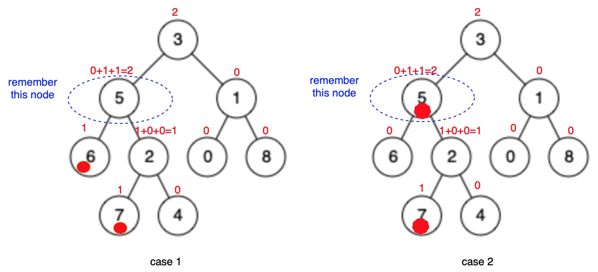

# 236. Lowest Common Ancestor of a Binary Tree


Two methods:

1. Harder to implement, but easy to understand. Every node returns information of &lt;ancestor, numOf\(p,q\)&gt;, which means:
   1. if in this node's tree, don't find \(p, q\), then return &lt;NULL, 0&gt;.
   2. if find one of \(p, q\), then return &lt;NULL, 1&gt;.
   3. if find both of \(p, q\), then return &lt;root, 2&gt;. ⚠️this node may be p or q, count it as well.
2. Easy to implement, but harder to understand. From top to bottom, very recursive return:
   1. if only node.left or node.right contains \(p, q\), continue returning the returnValue of lower level.
   2. if both of node.left and node.right contian p and q, they must be separated in left and right subtree, then return node, this is the real ancestor. 
   3. for higher level recursive, this node will continue passing up, because only one of any its parents' child has no-NULL returnValue.


### Solution 1:

1. edge case in main function.
2. traversal each node from bottom to up, to pass &lt;ancestor, numOf\(p, q\)&gt;.
3. return ancestor in main function.





```cpp
/**
 * Definition for a binary tree node.
 * struct TreeNode {
 *     int val;
 *     TreeNode *left;
 *     TreeNode *right;
 *     TreeNode(int x) : val(x), left(NULL), right(NULL) {}
 * };
 */
class Solution {
public:
    TreeNode* lowestCommonAncestor(TreeNode* root, TreeNode* p, TreeNode* q) {
        // every node carry information 0 or 1, 1 means find one of p/q, 0 means find none of them
        // when root.left = 1 and root.right = 1, then return root

        // edge case
        if(root == p or root == q) return root;
        // regular case, BFS
        pair<TreeNode*, int> result = find(root, p, q);
        return result.first;
    }
    
    // pair<TreeNode*, int> --> pair<ancestor, find 0/1/2>
    pair<TreeNode*, int> find(TreeNode* root, TreeNode* p, TreeNode* q) {
        // stop condition
        if(root == NULL) return {NULL, 0};
        if(root->left == NULL && root->right == NULL) {
            if(root == p || root == q) return {NULL, 1};
            return {NULL, 0};
        }
        
        // regular case
        pair<TreeNode*, int> left = find(root->left, p, q);
        pair<TreeNode*, int> right = find(root->right, p, q);
        int r = (root == p || root == q) ? 1 : 0;
        if(left.second == 2) return left;
        if(right.second == 2) return right;
        
        // return root if result != 2 doesn't matter, because this fake root will be replaced by real root eventually
        return {root, left.second+right.second+r};
    }

};
```







> Time complexity = $$O(n)$$ ,  因为每个节点只访问一次。space complexity = $$O(h)$$ ，这里的空间复杂度指的是栈深，最坏的情况就是所有点在一条直线上. $$n$$ is the number of nodes.




```java
class Solution {
    public TreeNode lowestCommonAncestor(TreeNode root, TreeNode p, TreeNode q) {
        if (root == p || root == q) return root;
        TreeNode l = (root.left == null) ? null : lowestCommonAncestor(root.left, p, q);
        TreeNode r = (root.right == null) ? null : lowestCommonAncestor(root.right, p, q);
        return (l != null && r != null) ? root : ((l == null) ? r : l);
    }
}
```

> Time complexity = $$O(n)$$ ,  因为每个节点只访问一次。space complexity = $$O(h)$$ ，这里的空间复杂度指的是栈深，最坏的情况就是所有点在一条直线上. $$n$$ is the number of nodes.







