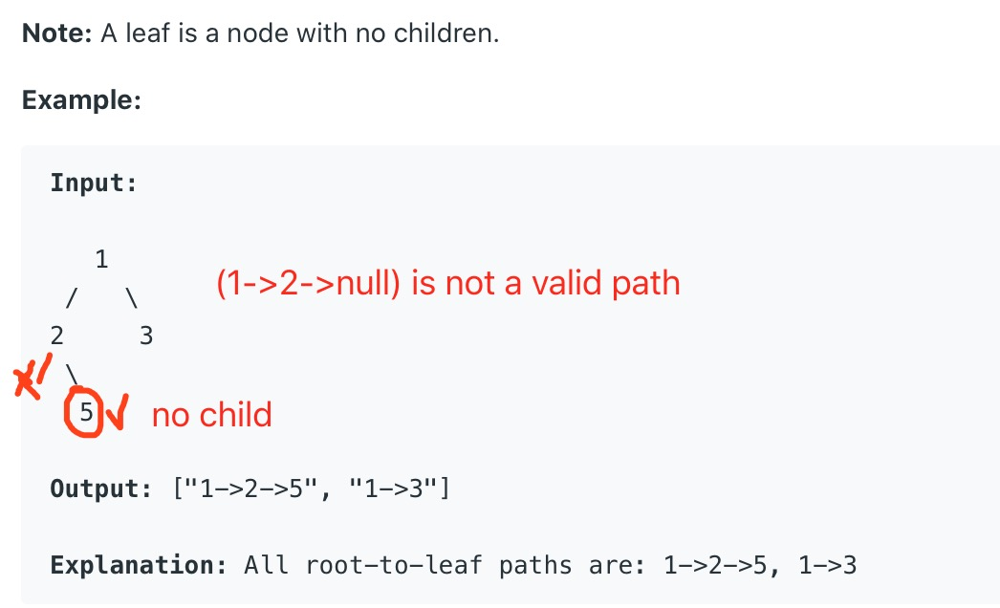

# 257. Binary Tree Paths


Not easy. Hard to think. Two cases are needed to consider in `helper` function.

1. `root` doesn't have any child, then this path completes
2. `root` is empty, then this path is invalid.

`List1 = [1, 2, 3], List2 = [2, 4, 6]. List1 + List2 = [1, 2, 3, 2, 4, 6]`

So in the implementation below, `List1 = ['1->2->5'], List2 = ['1->3']`, then `List1+List2 = [['1->2->5'], ['1->3']].`






```python
class Solution:
    def binaryTreePaths(self, root: TreeNode) -> List[str]:
        # edge case
        if root == None:
            return []
        
        # regular case
        path = ""
        return self.helper(root, path)
    
    def helper(self, root, path):
        # stop condition
        if root == None:
            return []
        
        if root.left == None and root.right == None:
            return [path + str(root.val)]
        
        # regular case
        path = path + str(root.val) + "->"
        return self.helper(root.left, path) + self.helper(root.right, path)
```

Time complexity = $$O(n)$$ , traversal all nodes. 







