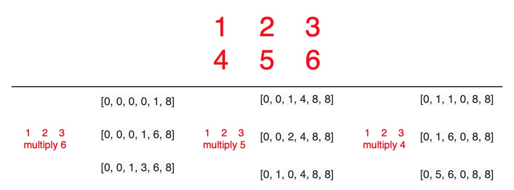

# 43. Multiply Strings


Key idea: 

1. `num1[x]*num2[y]` will occupy `result[x+y]`\(high digit\) and `result[x+y+1]`\(low digit\)
2. `num1*num2` have at most `len(num1)+len(num2)` digits.


### Solution:

1. define result list
2. multiply each pair
3. convert into string, remove high digit which is 0


`result` list = `[high digit, ..., low digit]`

思路不是特别难，但是要一次性写对太不容易了


Time complexity = Space complexity = $$O(n*m)$$ 

