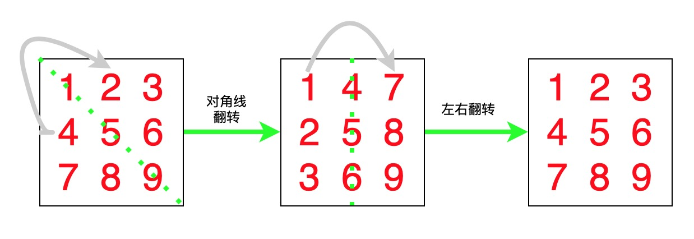

# 48. Rotate Image


会就是会，不会就是不会




```python
class Solution:
    def rotate(self, matrix: List[List[int]]) -> None:
        """
        Do not return anything, modify matrix in-place instead.
        """
        n = len(matrix)
        # 对角线交换
        for i in range(n):
            for j in range(i+1, n):
                matrix[i][j], matrix[j][i] = matrix[j][i], matrix[i][j]

        # 左右互换
        for i in range(n):
            for j in range(n//2):
                matrix[i][n-j-1], matrix[i][j] = matrix[i][j], matrix[i][n-j-1]
```

