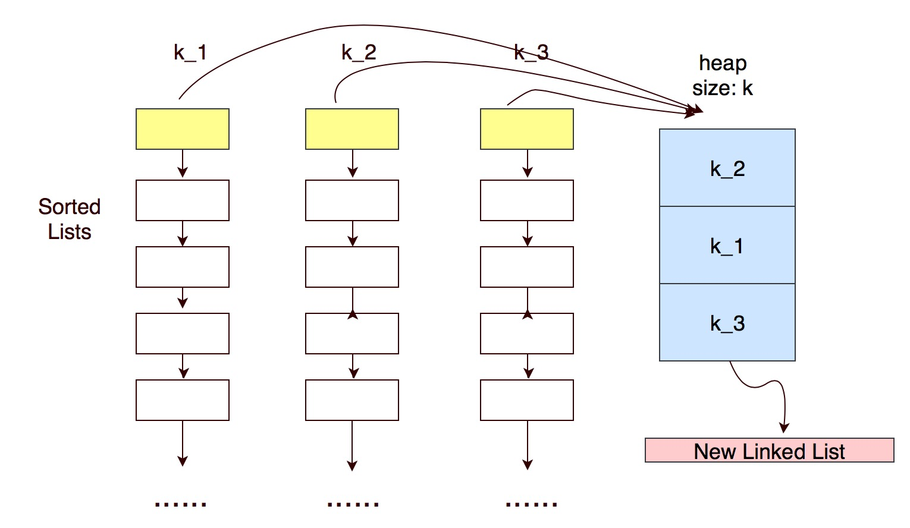

# 23. Merge k Sorted Lists


Key idea: using PriorityQueue to implement minimal heap

核心：用有线队列实现最小堆






1. add the head of each list to heap 
2. poll out top of heap adding to new linked list
3. add this element's next to heap
4. until heap is empty



1. 将每个linked list的头节点加入到堆
2. 将堆顶元素弹出加到新list
3. 将此元素的下一个元素加到堆里
4. 直到堆为空停止




PriorityQueue doesn't accept null, so before adding element, judge whether it is null

优先序列这种数据结构不接收空元素，所以在加入元素前先判断是否为空

PriorityQueue only accepts comparable elements, self-define data structure mustn't be comparable, so override comparator function of PriorityQueue is necessary

优先序列只接受能比较大小的元素，自定义的数据结构是不可比较的，因此必须重写comparator，然后用comparator去初始化优先序列


### Override comparator and PriorityQueue instance

```text
Comparator<ListNode> comparator = new Comparator<ListNode>(){
    @Override
    public int compare(ListNode node1, ListNode node2){
        if(node1.val>node2.val) return 1;
        else if(node1.val < node2.val) return -1;
        else return 0;
    }
};
          
Queue<ListNode> queue = new PriorityQueue<ListNode>(comparator);
```



Why using PriorityQueue to implement heap?

Because any element added to PriorityQueue, it will be sorted in $$O(lg N)$$ automatically in acceding order. Therefore, adding and deleting an element for PriorityQueue is $$O(lg N)$$ , find the smallest element is $$O(1)$$ . So solving this problem takes $$O(nlgK)$$ 



为什么要用优先序列实现堆？

因为优先序列在 $$O(lg N)$$ 的时间里对新加入的元素自动升序排序。因此插入元素和删除元素时间复杂度为 $$O(lg N)$$ ，查找最小元素时间复杂度为 $$O(1)$$ 。所以本题时间复杂度为 $$O(nlgK)$$ 



