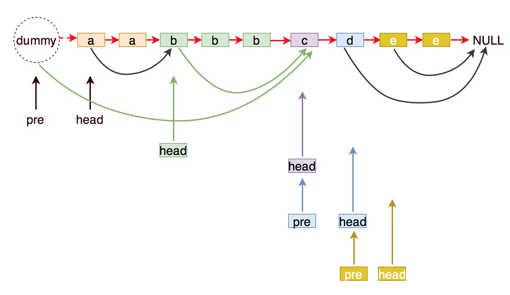
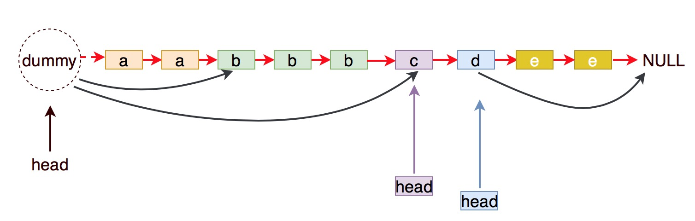

# 82. Remove Duplicates from Sorted List II


Key idea: skip all same elements until different one then move forward

核心：跳过所有相同的元素，直到碰到不同的元素再继续往前走


### Solution 1\(complicated version\): 



1. `head` points current node, once `head.val == head.next.val`, it deletes all duplicates except itself.
2. `pre` records pre-node of `head` and helps delete the first duplicates.
3. if not encounter duplicates, both of `pre` and `head` move one step.


Dummy note and pre-node are necessary. `flag` is needed to judge `head` is the last duplicate or nor. When last node is duplicate node, don't forget to let `pre.next = null` because `pre` represents the whole new list.




1. head 永远指向当前节点，一旦后一个节点与当前节点相同，则删除后一个节点，直到遇到不同的节点
2. pre 记录当前节点的前一个节点，当删除除了第一个外所有重复节点，pre帮助删除这个节点
3. 如果没有遇到重复，pre和head同时往后挪一位


虚拟节点和前置节点非常必要；需要一个`flag`标志位判断`head`是否是最后一个重复元素；当最后一个节点是重复节点时，要将`pre.next＝null`，因为`pre`才是新的list。




### Solution 2\(easy version\):



1. `head` represents new list.
2. record duplicates value and delete all duplicates until `head.next.val != head.next.next.val`.
3. otherwise head move one step.


Don't move `head` until ensure the next element is not duplicated.




1. `head`表示新list
2. 记录重复元素的值，并且一次删除所有重复直到`head.next.val != head.next.next.val`
3. 否则`head`往后一步


不要移动`head`，除非确认后一个元素不是重复元素





#### If deleting all duplicates required, we can record the value and delete them in on time; If deleting all duplicates except itself required, we can keep first one and delete others.

#### 如果要删除所有重复，那么可以记录下这个值并且一次性删除所有重复；如果删除所有重复但要保留一个，那么可以只保留第一个然后删掉所有后面出现的重复


