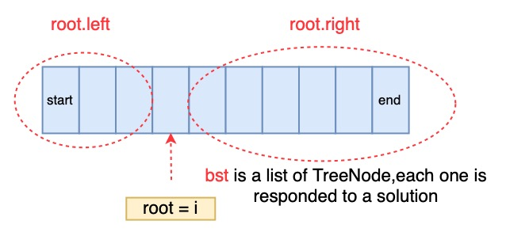

# 95. Unique Binary Search Trees II


不是很懂为什么在`helper`函数的开头要定义一个空的`bst`数组? 有点难做，需要再练习来加强。

`subTree(start, end)` 是在区间`[start, end]`中找出所有的解法，那么就是移动`root`，`root = [start: end]`，返回值是一个叫`bst`的`list`，存放所有解法的`TreeNode(root)`树结构。




### Solution:

1. 由于每次递归时，`bst`都是新的，因此helper函数的开头新建了一个空`bst`；
2. `root`左边有`n`个解法，`root`右边有`m`个解法，那么一共就有`n*m`个解法，所以一定要用两层嵌套的for循环得到新的`bst`；
3. helper函数中的终止条件要注意，当`start>end`时才终止，这时候一定要加上`NULL`，不然那么多`NULL`哪里加呢。这一点是最难想清楚的。



```python
# Definition for a binary tree node.
# class TreeNode:
#     def __init__(self, val=0, left=None, right=None):
#         self.val = val
#         self.left = left
#         self.right = right
class Solution:
    def generateTrees(self, n: int) -> List[TreeNode]:     
        # edge case
        if n == 0:
            return []

        return self.subTree(1, n)
    
    # bst -> List[TreeNode]
    # bst[i] means when (root = i-1), all possible BST
    def subTree(self, start, end): 
        # stop condition
        bst = []
        if start > end:
            bst.append(None)
            return bst
        
        # regular case
        for i in range(start, end+1):
            left = self.subTree(start, i-1)
            right = self.subTree(i+1, end)
            for x in left:
                for y in right:
                    root = TreeNode(i)
                    root.left = x
                    root.right = y
                    bst.append(root)
        return bst
```







Time complexity: $$f_i=\sum(f_{i-1})*\sum(f_{n-i})$$ 很难算，空间复杂度是一样的。

