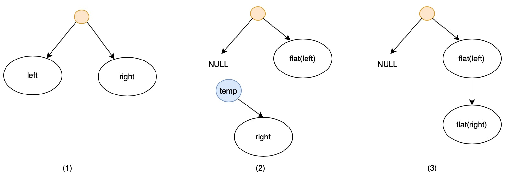

# 114. Flatten Binary Tree to Linked List


很有意思的一道题，思路其实不难，主要是recursive的思想，跟Tree没有太大关系。


### Solution:

1. transform `root.right` to `temp`.
2. flat `root.left` then transfer `root.right`.
3. assign `root` to `root2`, let `root2` goes to the bottom of the tree.
4. link `root2` with `flat(temp)`.
5. return `root`.
6. stop condition: `if root = NULL`, return imediately.





```cpp
/**
 * Definition for a binary tree node.
 * struct TreeNode {
 *     int val;
 *     TreeNode *left;
 *     TreeNode *right;
 *     TreeNode() : val(0), left(nullptr), right(nullptr) {}
 *     TreeNode(int x) : val(x), left(nullptr), right(nullptr) {}
 *     TreeNode(int x, TreeNode *left, TreeNode *right) : val(x), left(left), right(right) {}
 * };
 */
class Solution {
public:
    void flatten(TreeNode* root) {  
        flat(root);        
    }
    
    TreeNode* flat(TreeNode *root) {
        // edge case
        if(root == NULL) return NULL;
        
        TreeNode *temp = root->right;
        
        root->right = flat(root->left);
        root->left = NULL;
        
        TreeNode *root2 = root;
        while(root2->right != NULL) {
            root2 = root2->right;
        }
        
        root2->right = flat(temp);
        
        return root;
    }
};
```








