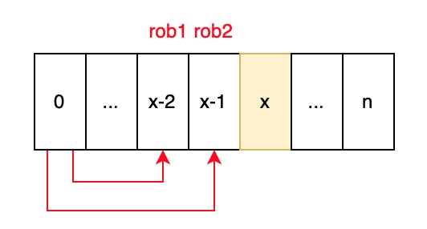

# 198. House Robber


Comes from Google interview. Classical DP problem. 


### Solution 1: regular sequence DP array. 

1. robs\[x\] means the max money can rob in `house [0:x]`
2. Initialize `robs[0]` and `robs[1]`. Initialize as much as possible.
3. Time complexity = $$O(n)$$ , spcase complexity = $$O(n)$$ 




```cpp
class Solution {
public:
    int rob(vector<int>& nums) {
    // edge case
        if(nums.empty()) return 0;
        if(nums.size() == 1) return nums.at(0);
        
        int robs[nums.size()];
        robs[0] = nums.at(0);
        robs[1] = max(nums.at(0), nums.at(1));
        for(int i = 2; i < nums.size(); i ++) {
            robs[i] = max(robs[i-2]+nums.at(i), robs[i-1]);
        }
        
        return robs[nums.size()-1];
    }
};
```








### Solution 2: optimize space complexity, because the previous robs are not useful

1. Only `robs[x-2]` and `robs[x-1]` are used for computing `robs[x]`.
2. Initialization is important.
3. Time complexity = $$O(n)$$ , space complexity = $$O(1)$$ 





```cpp
class Solution {
public:
    int rob(vector<int>& nums) {
        // edge case
        if(nums.empty()) return 0;
        // rob1 is two before current rob, rob2 is one before current rob
        int rob1, rob2 = 0;
        for(int i = 0; i < nums.size(); i ++) {
            int temp = max(rob1 + nums[i], rob2);
            rob1 = rob2;
            rob2 = temp;
            
        }
        
        return rob2;
    }
};
```







