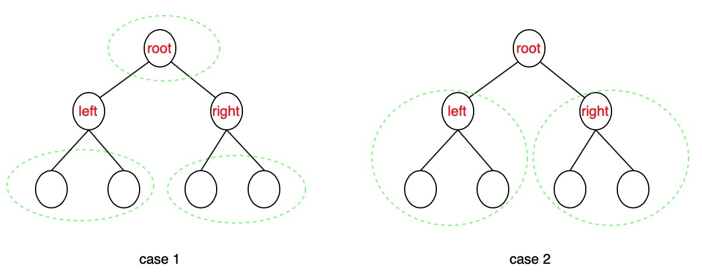

# 337. House Robber III


Two methods:

1. Recursive, from top to bottom to compute. Time consuming.
2. DP, very node records the largest money from this node to leaf.




### Solution 1:

Time complexity: $$h!$$ , `h` is tree's height. Space complexity: $$O(1)$$ .



```cpp
/**
 * Definition for a binary tree node.
 * struct TreeNode {
 *     int val;
 *     TreeNode *left;
 *     TreeNode *right;
 *     TreeNode() : val(0), left(nullptr), right(nullptr) {}
 *     TreeNode(int x) : val(x), left(nullptr), right(nullptr) {}
 *     TreeNode(int x, TreeNode *left, TreeNode *right) : val(x), left(left), right(right) {}
 * };
 */
class Solution {
public:
    int rob(TreeNode* root) {
        // edge case
        if(root == NULL) return 0;
        if(root->left == NULL and root->right == NULL) return root->val;
        
        // regular case
        int rob1 = rob(root->left) + rob(root->right); // don't rob root
        int rob2 = root->val;
        if(root->left != NULL) {
            rob2 = rob2 + rob(root->left->left) + rob(root->left->right);
        }
        if(root->right != NULL) {
            rob2 = rob2 + rob(root->right->left) + rob(root->right->right);
        }
        
        return max(rob1, rob2);
    }
};
```







### Solution 2:

Time complexity: $$O(n)$$ , n is number of nodes. Space complexity: $$O(h)$$ , 这里的空间复杂度是栈道深度。

只存计算当前root-&gt;leaf最大的money. 则只需要知道其子节点（left&right）含节点和不含节点的最大值。⚠️含节点的最大值是max\(含节点，不含节点\)，而不是必须包含次节点的最大值。由于每个节点需要知道两个值，所以用DP时要返回一对值。



```cpp
/**
 * Definition for a binary tree node.
 * struct TreeNode {
 *     int val;
 *     TreeNode *left;
 *     TreeNode *right;
 *     TreeNode() : val(0), left(nullptr), right(nullptr) {}
 *     TreeNode(int x) : val(x), left(nullptr), right(nullptr) {}
 *     TreeNode(int x, TreeNode *left, TreeNode *right) : val(x), left(left), right(right) {}
 * };
 */
class Solution {
public:
    int rob(TreeNode* root) {
        // edge case
        if(root == NULL) return 0;
        
        // regular case 
        pair<int, int> result = dp(root);
        return max(result.first, result.second);
    }
    
    // pair<int, int> --> pair<contain root, not contain root>
    pair<int, int> dp(TreeNode* root) {
        // stop condition
        if(root == NULL) return {0,0};
        if(root->left == NULL and root->right == NULL) return {root->val, 0};
        
        // regular condition
        pair<int, int> left = dp(root->left);
        pair<int, int> right = dp(root->right);
        int r = left.second + right.second + root->val;
        int n_r = left.first + right.first;
        return {max(r, n_r), n_r};
    }
    
};
```








