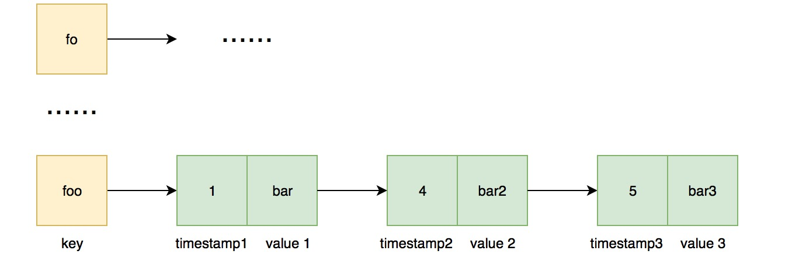

# 981. Time Based Key-Value Store


### Key idea: efficient dataframe to do \(map + binary search\)

### 核心：高效的数据结构来完成（HashMap＋二分查找法）


### Solution 1:

Store "key, timestamp, value" as HashMap&lt;String, ArrayList&lt;Pair&lt;Integer, String&gt;&gt;&gt;. Call Collections.binarySearch\( \) to support `get operation`

Time complexity of `set operation` is $$O(1)$$  and `get operation` is $$O(lg N)$$ 

`存储为 HashMap<String, ArrayList<Pair<Integer, String>>> 的数据结构，对应为 key: (timestamp, value)。 调用 Collections.binarySearch( ) 完成 get 操作。set 时间复杂度是O(1)，get 时间复杂度为 O(lg N)。`

### Solution 2:

Store "key, timestamp, value" as HashMap&lt;String, TreeMap&lt;Integer, String&gt;&gt;. 

Time complexity of `set operation` is $$O(lg N)$$  and `get operation` is $$O(lg N)$$ 

`存储为 HashMap<String, TreeMap<Integer, String>> 的数据结构，对应为 key: (timestamp: value)。set 和 get 的时间复杂度都是 O(lg N)。`




Learning

* **Map** is an interface that should be instantiated before using. Two main implementation are HashMap and TreeMap. The main difference is that TreeMap sorts elements in binary tree when adding new element. 
* **List** is an interface. ArrayList, LinkedList, Stack and Vector are its implementation. ArrayList and LinkedList are the most common used. ArrayList accesses element quickly but add and delete element slowly. LinkedList accesses element slowly but add and delete element quickly. [https://docs.oracle.com/javase/7/docs/api/java/util/List.html](https://docs.oracle.com/javase/7/docs/api/java/util/List.html) 
* **`Collections.binarySearch(List, key).`** ``Search an element in a sorted List sorted in ascending order by binary search. If key exists, return its index. If key doesn't exist, return **`(-(insertion point)-1)`**. If search an element in a decending sorted List, we can use `collections.binarySearch(List, Key, collections.reverseOrder()).`[https://www.geeksforgeeks.org/collections-binarysearch-java-examples/](https://www.geeksforgeeks.org/collections-binarysearch-java-examples/) ~~``~~ ``





学习贴士

* Map 是一种集合类，有两种主要的实现接口：HashMap 和 TreeMap。它们主要的区别是，HashMap 无序存储，TreeMap在添加元素的同时自动按照二叉树排序，使其有序。
* List是另一种集合类，有四种常见的接口：ArrayList, LinkedList, Stack 和Vector， 其中ArrayList 和 LinkedList 最常用。ArrayList底层数据结构是数组，因此查询快，增删慢；LinkedList底层数据结构是链表，因此查询慢，增删快。
* `Collections.binarySearch(List, key).` 这个函数用二分法查找在一个升序的List中的某个元素。如果这个元素存在，返回其下标；否则返回`（- (insertion point) - 1）`。如果要在一个降序List中查找某个元素可以这样操作：`Collections.binarySearch(List, key, collections.reverseOrder())。`




