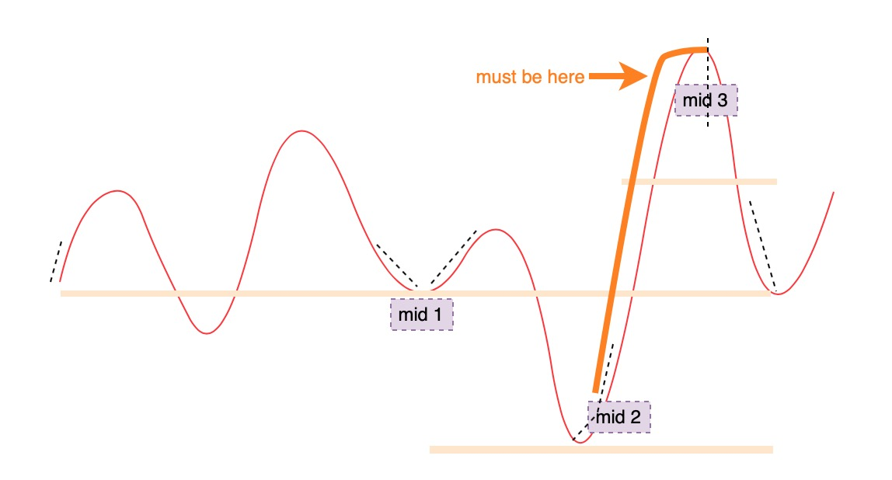

# 162. Find Peak Element

二分法中心思想：

要么留下可能的一半，要么去掉不可能的一半

### Solution:

1. find first ascending position from begining as left, and first ascending position from the end as right
2. compute mid, keep the possible part according to left and right slope of mid（3 cases: mid is lowest peak then both of left and right are possible, mid is higheset peak then return, mid's left or right part is possible ）
3. edge cases: 1 element, ascending list, descending list


极端例子很容易忽略掉


