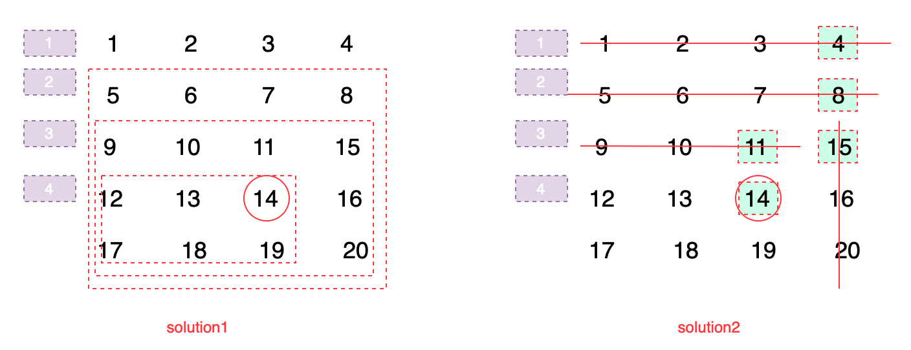

# 240. Search a 2D Matrix II


find the fisrt position in a row bigger than target, then throw corresponded columns

consider edge case


> matrix is `m` rows and `n` columns, `m * n`

### Solution 1:

check from first to last row, find the first position in a row bigger than target, then throw one row or a few columns with one row

do search insertion position in each row

time complexity: $$O(m*lg(n))$$ 

### Soultion 2:

check from right top or left bottom element, every time throw one column or row

Time complexity: $$O(m+n)$$ 

