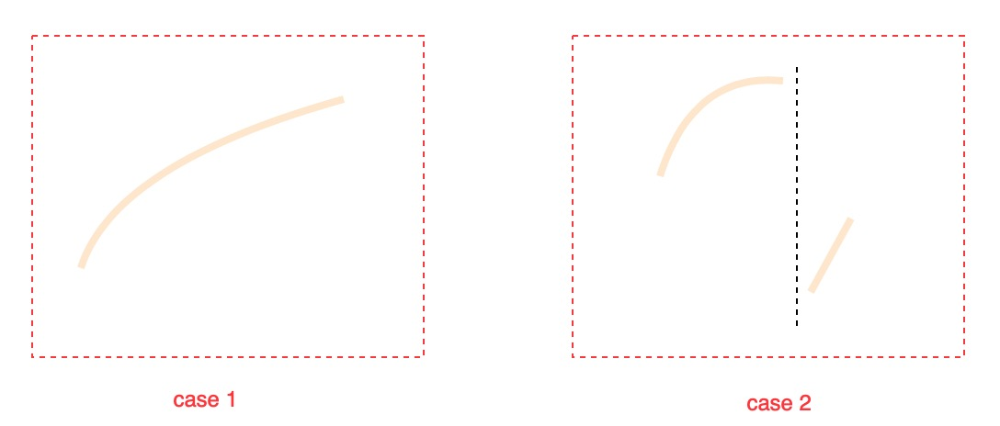

# 33. Search in Rotated Sorted Array



### Solution

Case 1: no rotated, just do binary search as regular

Case 2: is rotated, find the pivot, and do binary search in one of two parts

#### How to find the pivot? 

```python
if nums[mid] < left:
    left = left
    right = mid
else:
    left = mid
    right = right
```

#### 

