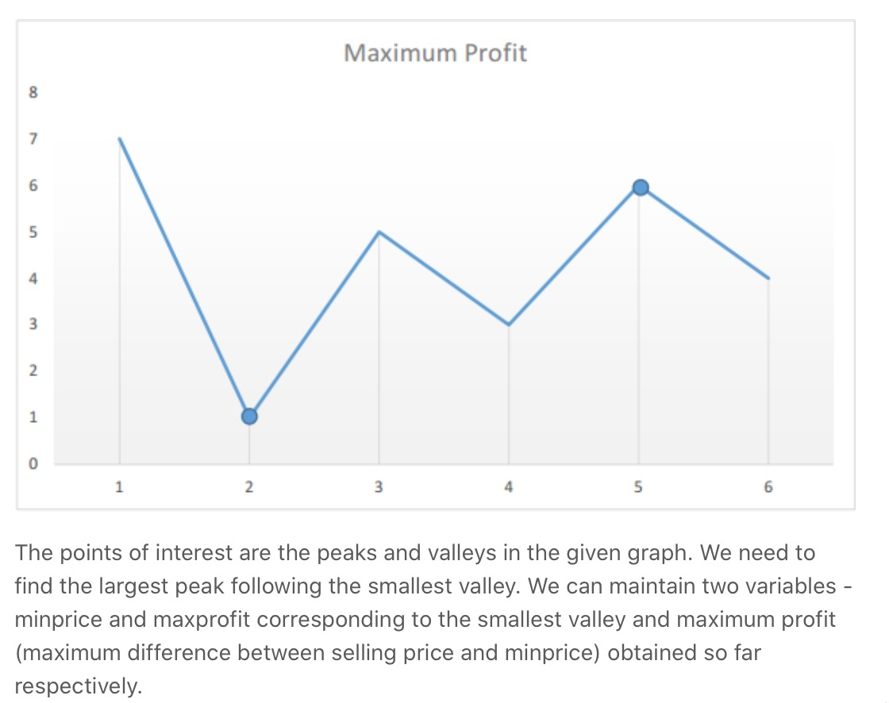

# 121. Best Time to Buy and Sell Stock


折线题，minpeak and maxpeak

暴力解题一定会超时

记录maxprofit，和minpeak

很有意义的一道关于折线的基础题




### Solution:

1. if prices\[i\]&lt;minpeak, 找到了当前最小值
2. if prices\[i\] 不是最小值，计算profit，看能否获得最大盈利

```python
class Solution:
    def maxProfit(self, prices: List[int]) -> int:
        # edge case
        if len(prices) == 0:
            return 0
        
        maxprofit = 0
        minpeak = prices[0]
        for i in range(len(prices)):
            if prices[i] < minpeak:
                minpeak = prices[i]
            elif prices[i] - minpeak > maxprofit:
                maxprofit = prices[i] - minpeak
                    
        return maxprofit
```

Time complexity = $$O(n)$$ , space complexity = $$O(1)$$ 

