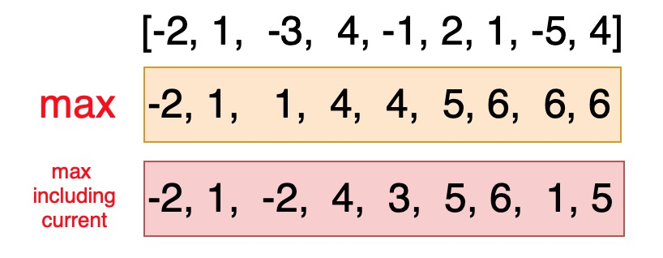

# 53. Maximum Subarray


Dynamic Programming

Two variables: \(1\) max sum; \(2\) max sum including current number




```python
class Solution:
    def maxSubArray(self, nums: List[int]) -> int:
        m = nums[0]
        tmp = nums[0]
        for i in range(1, len(nums)):
            if tmp < 0:
                tmp = nums[i]
            else:
                tmp += nums[i]
            if tmp > m:
                m = tmp
            
        return m
```

Time complexity = $$O(n)$$ , Space complexity = $$O(1)$$ .

