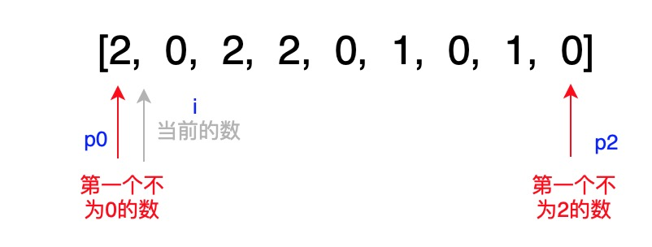

# 75. Sort Colors


Key idea:

`2` must be the end, `0` must be the begining.

Record the index of next possible `0` as `p0`; record the index of next possible `2` as `p2`.




### Solution:

1. if `nums[i] = 0`, swap\(nums\[p0\], nums\[i\]\), p0 and i move forward one step
2. if `nums[i] = 2`, swap\(nums\[i\], nums\[p2\]\), p2 move back one step
3. if `nums[i] = 1`, only i move forward one step

```python
class Solution:
    def sortColors(self, nums: List[int]) -> None:
        """
        Do not return anything, modify nums in-place instead.
        """
        p0 = 0
        i = 0
        p2 = len(nums) - 1
        while i <= p2:
            if nums[i] == 0:
                nums[i] = nums[p0]
                nums[p0] = 0
                p0 += 1
                i += 1
            elif nums[i] == 2:
                nums[i] = nums[p2]
                nums[p2] = 2
                p2 -= 1
            else:
                i += 1
                
        return nums
```


最难想的是`nums[i] = 1`该怎么处理，跳过即可，但是不能挪`p0`指针


Time complexity = $$O(n)$$ , space complexity = $$O(1)$$ 

