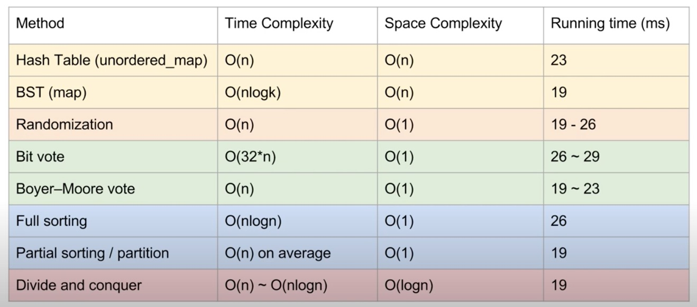

# 169. Majority Element\(位运算\)





```python
 class Solution:
    def majorityElement(self, nums: List[int]) -> int:
        res = 0
        for i in range(32):
            ones = 0
            zeros = 0
            x = 1 << i
            for num in nums:
                if num & x != 0:
                    ones += 1
                else:
                    zeros += 1
                if ones > len(nums)//2 or zeros > len(nums)//2:
                    break
            if ones > len(nums)//2:
                res = res | x

        return res
        
# incorrect when test [-2^31], output is [2^31]
# but if coding in C++, then it's correct, why??????                            
```



```python
class Solution:
    def majorityElement(self, nums: List[int]) -> int:
        hashMap = {}
        for num in nums:
            if num not in hashMap:
                hashMap[num] = 1
            else:
                hashMap[num] += 1
        for key, value in hashMap.items():
            if value > len(nums)//2:
                return key
```




