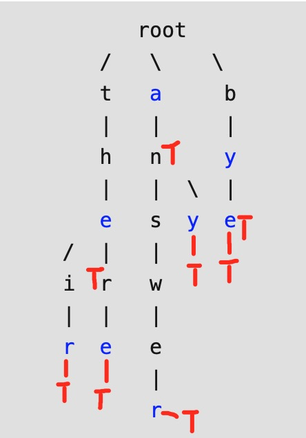

# 208. Implement Trie \(Prefix Tree\)


Key idea:

Every **TrieNode** stores one letter, there are alph\_size of children in each layer. Root doesn't store any letter, the last leaf stores `isEndOfWord` other than letter.

```cpp
class TrieNode {
public:
    TrieNode *child[26];
    bool isWord;
};
```






```cpp
class TrieNode {
public:
    TrieNode *child[26];
    bool isWord;
    TrieNode(): isWord(false) {
        for(auto &a : child) a = nullptr;
    }
    
};

class Trie {
public:
    /** Initialize your data structure here. */
    Trie() {
        root = new TrieNode();
    }
    
    /** Inserts a word into the trie. */
    void insert(string word) {
        TrieNode *p = root;
        for(auto &a : word) {
            int i = a - 'a';
            if(!p->child[i]) p->child[i] = new TrieNode();
            p = p->child[i];
        }
        p->isWord = true;
    }
    
    /** Returns if the word is in the trie. */
    bool search(string word) {
        TrieNode *p = root;
        for(auto &a : word) {
            int i = a - 'a';
            if(!p->child[i]) return false;  // if the child is ended
            p = p->child[i];
        }
        return p->isWord;
    }
    
    /** Returns if there is any word in the trie that starts with the given prefix. */
    bool startsWith(string prefix) {
        TrieNode *p = root;
        for(auto &a : prefix) {
            int i = a - 'a';
            if(!p->child[i]) return false;
            p = p->child[i];
        }
        return true;
    }
    
private:
    TrieNode *root;
};


/**
 * Your Trie object will be instantiated and called as such:
 * Trie* obj = new Trie();
 * obj->insert(word);
 * bool param_2 = obj->search(word);
 * bool param_3 = obj->startsWith(prefix);
 */
```



> for\(auto &a : s\) 的用法注意了，是只能用指针么？

