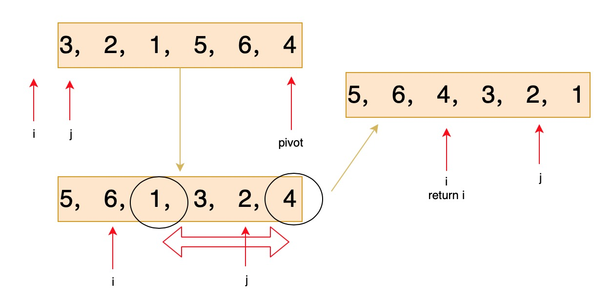

# 215. Kth Largest Element in an Array


quicksort中的partition方法，非常难理清楚

升序比较简单，但是降序排列很难理清楚，取`(k-1)th`数

不用完全排序出来，只确保k-1前面的数都比它大，后面的数都比它小就行了






```cpp
class Solution {
public:
    int findKthLargest(vector<int>& nums, int k) {
        int left = 0, right = nums.size()-1;
        while(true) {
            int pivot = partition(nums, left, right);
            if(pivot == k-1) return nums[pivot];
            if(pivot > k-1) right = pivot-1;
            else left = pivot+1;
        }
    }
    
    int partition(vector<int>& nums, int left, int right) {
        int i = left-1, j = left, pivot = nums[right];
        while(j < right) {
            if(nums[j] >= pivot) {
                i ++;
                swap(nums[i], nums[j]);
            }
            j ++;
        }
        swap(nums[right], nums[++i]);
        return i;
    }
};
```




