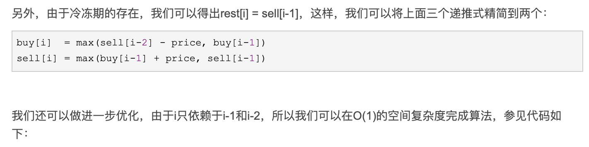

# 309. Best Time to Buy and Sell Stock with Cooldown

很难想，直接看代码吧。



```python
class Solution:
    def maxProfit(self, prices: List[int]) -> int:
        buy = float('-inf')
        pre_buy, pre_sell, sell = 0, 0, 0
        for price in prices:
            pre_buy = buy
            buy = max(pre_sell-price, pre_buy)
            pre_sell = sell
            sell = max(pre_buy+price, pre_sell)

            
        return sell

```


Two key formulas:

buy = max\(pre\_sell-price, pre\_buy\) 当前位置为买的最大收益，要么两天前卖了，现在买，要么就是之前买了没有卖的最大收益

sell = max\(pre\_buy+price, pre\_sell\) 当前位置为卖的最大收益，要么头一天买了今天卖掉，要么就是一天前就卖了还未买进的最大收益

最后返回当前位置卖的最大收益，最后肯定是卖出了收益最大，因为如果最后一个数是买入，则有钱套在其中不算收益

参考链接：[https://www.cnblogs.com/grandyang/p/4997417.html](https://www.cnblogs.com/grandyang/p/4997417.html)


