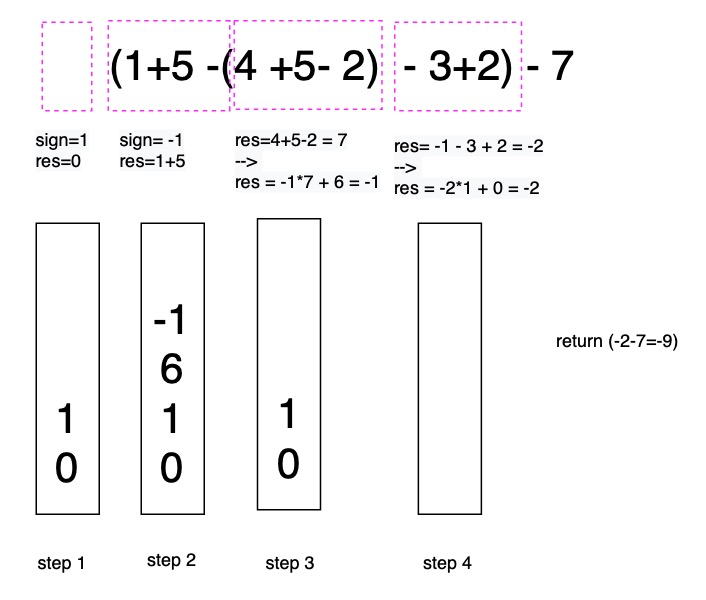

# 224. Basic Calculator


Key idea: stack, which can skip space

Take \(1+5 - \(4+ 5- 2\) - 3+2\) - 7 as example:

= 0 + 1\*\[ \(1+5-\(4+5-2\)-3+2\) \] -7 

= 0 + 1\*\[ 6+\(-1\)\*\( 4+5-2\)-3+2 \]-7 

= 0 + 1\*\[ 6 + \(-1\)\*7 -3+2 \] -7 

= 0 + 1\*\[  -1 -3 +2\] -7 \]

= 0 + 1\* \(-2\) - 7

= -9




```python
class Solution:
    def calculate(self, s: str) -> int:
        stack = []
        sign = 1   # 1 means positve, -1 means negative
        res = 0   
        num = 0  # the complete number
        
        for ch in s:
            if ch.isdigit():
                num = num*10 + int(ch)
            elif ch == '+':
                res += sign * num
                sign = 1
                num = 0
            elif ch == '-':
                res += sign * num
                sign = -1
                num = 0
            elif ch == '(':
                stack.append(res)
                stack.append(sign)
                sign = 1
                res = 0
            elif ch == ')':
                res += sign*num
                res = res*stack.pop()
                res += stack.pop()
                num = 0
                
        return res + sign * num
```

