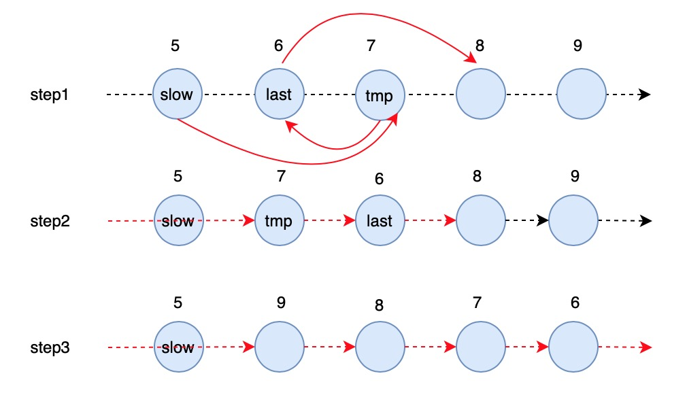

# 234. Palindrome Linked List


Method 1:

Two pointers, one list to store the first half elements in order.

`1 -> 2 -> 1` and `1 -> 2 -> 2 -> 1` are palindrome linked list.

Two cases: the length of the linked list is **odd** or **even**.

Method 2:

**slow**, **fast** pointers. When slow goes to the middle of the list, reverse the last half of list, then compare front to end one by one.




```python
# Definition for singly-linked list.
# class ListNode:
#     def __init__(self, val=0, next=None):
#         self.val = val
#         self.next = next
class Solution:
    def isPalindrome(self, head: ListNode) -> bool:
        # edge case
        if head == None or head.next == None:
            return True
        
        collect = []
        tmp = head
        while True:
            collect.append(head.val)
            # 判断nodelist的长度是奇数还是偶数
            if tmp.next == None:   # 奇数
                flag = 1
                break
            elif tmp.next.next == None:   # 偶数
                flag = -1
                break
            tmp = tmp.next.next
            head = head.next
        
        if flag == 1:   # the nodelist is odd
            while head != None:
                if collect.pop() != head.val:
                    return False
                head = head.next
        else:    # the nodelist is even
            while head.next != None:
                head = head.next
                if collect.pop() != head.val:
                    return False
        
        return True
        
```

> Time = $$O(n)$$ , Space = $$O(n)$$, How to reduce space to $$O(1)$$ ?



```python
# Definition for singly-linked list.
# class ListNode:
#     def __init__(self, val=0, next=None):
#         self.val = val
#         self.next = next
class Solution:
    def isPalindrome(self, head: ListNode) -> bool:
        # edge case
        if head == None or head.next == None:
            return True
        
        # find the middle position of the nodelist
        slow = head
        fast = head
        while fast.next != None and fast.next.next != None:
            fast = fast.next.next
            slow = slow.next

        # reverse the last half of the nodelist
        last = slow.next
        while last.next != None:
            tmp = last.next
            last.next = tmp.next
            tmp.next = slow.next
            slow.next = tmp
        
        # compare the front with the end one by one
        while slow.next != None:
            slow = slow.next
            if head.val != slow.val:
                return False
            head = head.next
            
        return True
```



> Time = $$O(n)$$ , Space = $$O(1)$$



 


