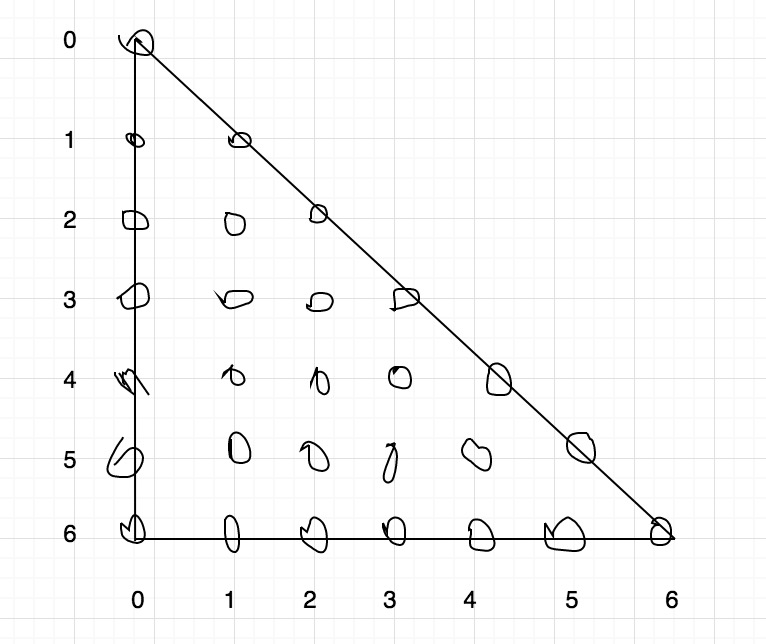

# 120. Triangle


### Key idea: memorize search＋from bottom to top

### 核心：记忆搜索＋自底而上


\(0,0\) -&gt; \(1,0\), \(1,1\)

\(1,0\) -&gt; \(2,0\), \(2,1\) ;    \(1,1\) -&gt; \(2,1\), \(2,2\) ;

\(2,0\) -&gt; \(3,0\), \(3,1\) ;     \(2,1\) -&gt; \(3,1\), \(3,2\) ;     \(2,2\) -&gt; \(3,2\), \(3,3\) ;

........

According to above, \(2,1\)   \(3,1\)   \(3,2\)  are repeated. If do regular DFS, every node has 2 choices, left or right in the next row. Therefore, time complexity is $$O(2^n)$$ . So another method is to store all the minimal path from any node to the last row. We let `dfs(int x, int y)` records the minimal path sum from `(x,y)` to the last row.

 `sumPath[x][y] = min(dfs(x+1, y),dfs(x+1, y+1)) + traingle[x][y]`

Space complexity is $$O(n^2)$$ \(`sumPath[][]`\). Because every node is only needed to compute once, there are $$(n(n+1))/2$$  times of computation, if every computation is $$O(1)$$ , then time complexity is $$O(n^2)$$ 

If we do from bottom to up to record the minimal path for each node, we only need a `int[] minPath` to store the minimal path for each node of next row. Then taking advantage of `minPath[]` infers the minimal path of each node in current row. The result is `minPath[0][0]`. The space complexity is $$O(n)$$ , the time complexity is $$O(n^2)$$ 


Deciding which part of the cache to discard to save space can be a hard job.

此题关键是，`dfs`记录当前状态到达目标状态的耗费，记忆化搜索就是`dfs`带值回来。

不仅要做DFS，还要自下而上方便存储，并且每次DFS要带值回来，`dfs(x,y)`即从`（x,y）`到终点的最短路径。

求最值一般可以用动态规划实现，而不是列举所有可能性。动态规划的精髓是记忆化搜索，记忆化搜索的精髓是自底而上，值可以被重复利用。




#### DP is memorize search

Advantage: easy to think and implement

Disadvantage: Expensive memory cost



#### 动态规划的本质是记忆化搜索

优点：容易想到并实现

缺点：耗费存储空间



