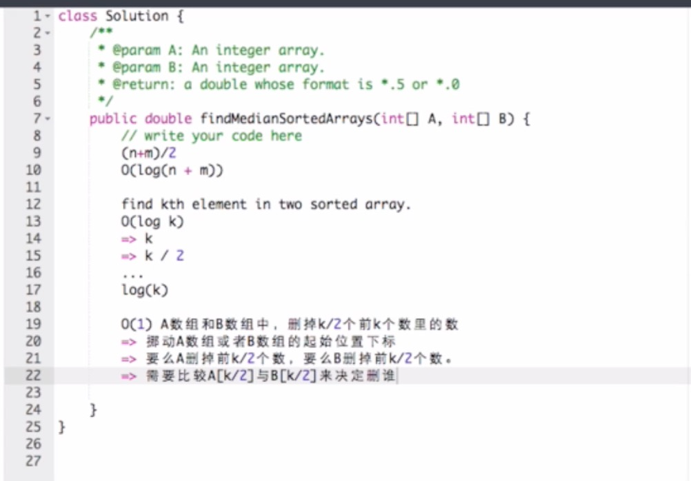

# 4. Median of Two Sorted Arrays

### Solution 1:

Compare the `len(nums1)/2`th  and `len(nums2)/2`th element, increase or decrease the position based on different situations. Very hard. Give up temporary. Time complexity is $$O(lg(min(m,n)))$$ 

[Detail explanation tutorial](https://medium.com/@hazemu/finding-the-median-of-2-sorted-arrays-in-logarithmic-time-1d3f2ecbeb46)

### Solution 2:

Think about it as finding the `k`th element in two sorted array. Compare the`k/2`th element in `nums1` and `k/2`th element in `nums2`, then throw `k/2` element. This algorithm uses iteration with binary search. Its time complexity is $$O(lgk)$$ 

