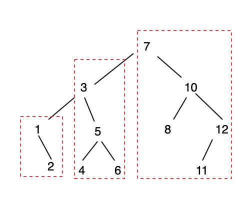

# 173. Binary Search Tree Iterator


Use interative instead of recursive to do inorder traversal by stack.




### Solution:

> If binary tree is a valid binary tree, left subtree is bigger than root, right subtree is bigger than root.

1. Start from root, push all left nodes to stack. `[7, 3, 1]`
2. Pop out one node from stack, declare `node.right` as new root, then add all left nodes of that new root to stack.
3. stack = `[7, 3, 2]`    result = `[1]`
4. stack = `[7, 3]`          result = `[1,2]`
5. stack = `[7, 5, 4]`    result = `[1,2,3]`
6. stack = `[7, 5]`          result = `[1,2,3,4]`
7. stack = `[7, 6]`          result = `[1,2,3,4,5]`
8. stack = `[7]`                result = `[1,2,3,4,5,6]`
9. stack = `[10, 8]`        result = `[1,2,3,4,5,6,7]`
10. stack = `[10]`              result = `[1,2,3,4,5,6,7,8]`
11. stack = `[12, 11]`     result = `[1,2,3,4,5,6,7,8,10]`
12. stack = `[12]`              result = `[1,2,3,4,5,6,7,8,10,11]`
13. result = `[1,2,3,4,5,6,7,8,10,11,12]`

```python
class Solution:
    def inorder(self, root, stack):
        if root == None:
            return stack        
        
        while root != None:
            stack.append(root)
            root = root.left      
        
    def inorderTraversal(self, root: TreeNode) -> List[int]:
        stack = []
        result = []
        # add all left nodes of root to stack
        self.inorder(root, stack)
        while len(stack) != 0:            
            root = stack.pop()
            result.append(root.val)
            # if this root has right nodes, add all its left nodes to stack iteratively
            if root.right != None:
                self.inorder(root.right, stack)
                
        return result
```

