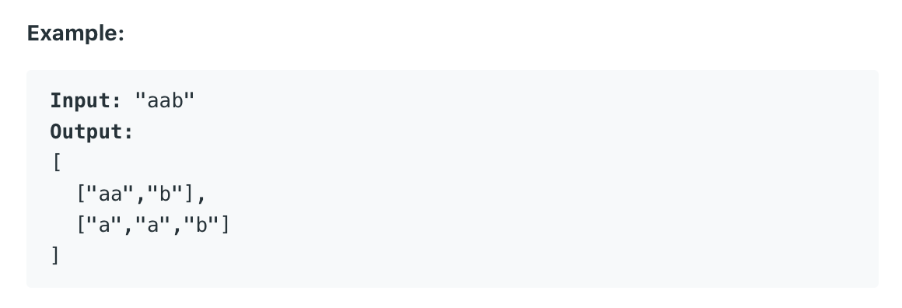

# 131. Palindrome Partitioning


回文子集：一个string的substring的集合中所有元素都是回文（正反读都是一样的），substring里的字母都不重复




### Solution:

定义一个subs为string类型，相当于子集集合里的每个字符串，每次多加一个字母，判断是否是回文，不是的话继续加一个后面的字母，如果是回文，就加入子集集合中。若是碰到了return就回溯到是回文的状态，尝试别的可能的组合。

helper函数的终止条件`if index == len(s)`



```python
class Solution:
    def partition(self, s: str) -> List[List[str]]:
        # edge case
        result = []
        if len(s) == 0:
            return result
        
        level = []
        self.helper(s, level, result, 0)
        return result
    
    def helper(self, s, level, result, index):
        # stop condition
        if index == len(s):
            result.append(level[:])
            return
            
        # regular case
        subs = ''
        for i in range(index, len(s)):
            subs = subs + s[i]
            if self.isPalin(subs) == True:
                level.append(subs[:])
                self.helper(s, level, result, i+1)
                level.pop()
                
    def isPalin(self, subs):
        for i in range(0, len(subs)//2):
            if subs[i] != subs[len(subs)-i-1]:
                return False
        return True
```



> Input: "aabcd"
>
> Output:`level`\(before adding new element\), `subs`\(may be added to level\)

`[] a` 

`['a'] a` 

`['a', 'a'] b` 

`['a', 'a', 'b'] c` 

`['a', 'a', 'b', 'c'] d` 

`['a', 'a', 'b'] cd` 

`['a', 'a'] bc` 

`['a', 'a'] bcd` 

`['a'] ab` 

`['a'] abc` 

`['a'] abcd` 

`[] aa` 

`['aa'] b` 

`['aa', 'b'] c` 

`['aa', 'b', 'c'] d` 

`['aa', 'b'] cd` 

`['aa'] bc` 

`['aa'] bcd` 

`[] aab` 

`[] aabc` 

`[] aabcd`




