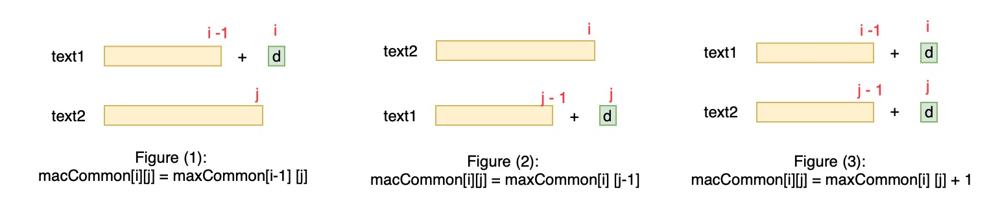

# 1143. Longest Common Subsequence


Very similar to \#72, two-sequence DP problem

Subsequence: 子序列，可以跳着来

Substring: 子串，必须元素连续着


### Solution:

1. Initialize `maxCommon[i][j]`, which means longest common substring between `text1[:i]` and `text2[:j]`. Empty element is necessarily needed
2. Three cases:

   1. `maxCommon[i-1][j]`. eg, `abc+d` and `ace`
   2. `maxCommon[i][j-1]`. eg, `abc` and `ac+d`
   3. If `text1[i] = text2[j]`, then `maxCommon[i][j] + 1` common char. eg, `abc+d` and `ace+d`

   Compare to assign biggest number to `maxCommon[i][j]`





```python
class Solution:
    def longestCommonSubsequence(self, text1: str, text2: str) -> int:
        # initilize maxCommon
        maxCommon = [[-1]*(len(text2)+1) for i in range(len(text1)+1)]
        for i in range(len(text1)+1):
            maxCommon[i][0] = 0
        for j in range(len(text2)+1):
            maxCommon[0][j] = 0
            
        # compute
        for i in range(1, len(text1)+1):
            for j in range(1, len(text2)+1):
                maxCommon[i][j] = max(maxCommon[i-1][j], maxCommon[i][j-1])
                if text1[i-1] == text2[j-1]:
                    maxCommon[i][j] = max(maxCommon[i][j], maxCommon[i-1][j-1]+1)
                    
        return maxCommon[len(text1)][len(text2)]
```







