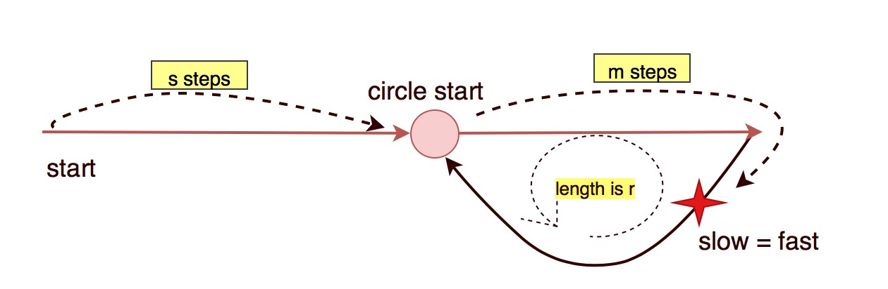

# 142. Linked List Cycle II




Assume `fast` goes `2k` steps and `slow` goes `k` steps, then they meet. Assume slow goes $$k=s+m+ar$$steps, fast goes $$2k=s+m+br$$ steps, $$a > b$$ . 

So in math, $$2k=2(s+m+ar)=s+m+br$$ 

Obviously, $$s+m =nr, s = nr-m$$ 

Assume $$n=1, s = r-m$$ \(why assume `n=1`\)

When `slow = fast`, let `slow` continues moving and `start` move at the same time at the same step until they meet. The steps `start` walks is the circle meeting.



Initialize`start = head` and `slow = head`. After they move then compare them.


```python
class Solution:
    def detectCycle(self, head: ListNode) -> ListNode:
        # edge case
        if head == None:
            return None
        
        # regular case 
        slow = head
        fast = head.next
        
        while slow != fast:
            if fast == None or fast.next == None:
                return None
            slow = slow.next
            fast = fast.next.next
            
        # s+m+br+1 = 2(s+m+ar) -> s=nr+1-m=r-m+1
        # let start meet slow
        start = head
        while start != slow.next:
            start = start.next
            slow = slow.next
            
        return start
```

