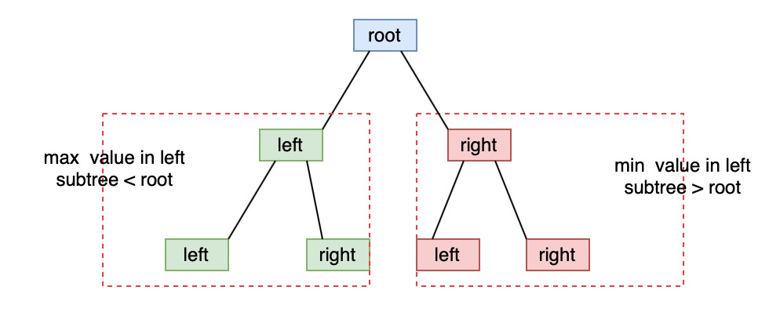

# 98. Validate Binary Search Tree


We need a helper function to return each subtree's minimum and maximun values.


### Solution 1:

1. helper function - max and min value in a subtree
2. isValid function - both of left and right subtrees are valid, left\_max &lt; root and right\_min &gt; root, then it's valid.

### Solution 2:

Compute inorder binary tree traversal, if whole list is ascending, then it's valid.

