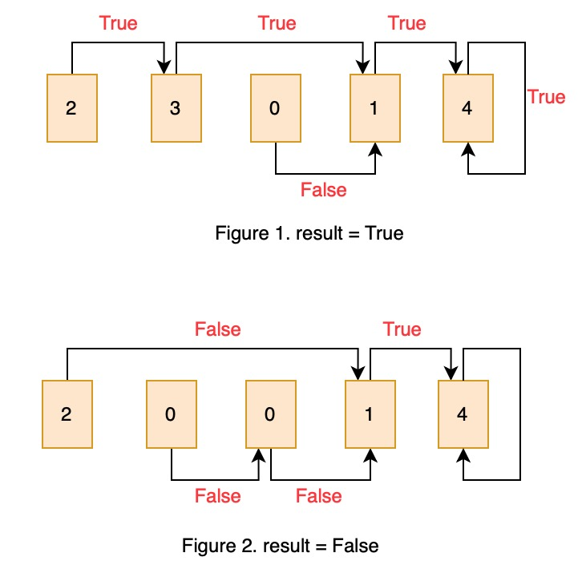

# 55. Jump Game


From end to beginning of the list to record True status. Two pointer: start, end. start move from previous of end until the element of the list can reach end, record True or False status until start out of index.


### Solution:

1. Initilize all variables. end = len\(nums\)-1, start = len\(nums\)-2, flag = True \(because current status is: from last element to last element, it must be True\)
2. Two pointer: start and end move. If distance\(end-start\) &lt;= nums\[start\], end jumps to start, start move to pre-element, set flat=True
3. Using while loop to control the index of start until out of index. 
4. return result=flag





```python
class Solution:
    def canJump(self, nums: List[int]) -> bool:
        l = len(nums)
        end = l-1    # last True index in nums
        start = l-2 # index of start in nums, from start to end to see if possible
        flag = True # current status, List[l-1] -> List[l-1]
        
        while start >= 0:
            if nums[start] >= end - start: # 需要的步数是否能够到达end
                end = start
                flag = True
            else:
                flag = False
            start = start-1
        
        return flag
```







