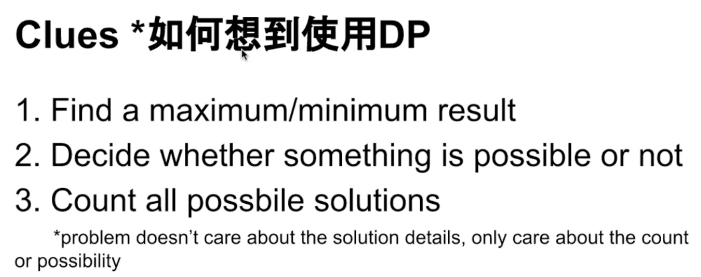

# IX. Dynamic Programming


In Python, build nested list like: `list = [[0]*n]*m`, when doing `list[0][0]=3`, the whole `0th` column will become `3`. Because shallow copy happens when creating the list's `2nd` and `3rd` rows. 

In order to do deep copy all the time, we have to build list like this: `list = [[0]*n in range(m)]`, then we can modify one element using `list[0][0]=3`.

[Refer link](https://blog.csdn.net/sjtuxx_lee/article/details/86709535)


> 动态规划的本质是记忆化搜索，自上而下，每次搜索只记录一个值，已经计算过的值不再重复计算。一般不使用recursive，而是使用iterative.

### Advantage:

Easy to think and implement.

### Disadvantage:

Expensive memory to cost. Has to record all points.

### 让搜索的时候带一个值，这个值是从当前点出发最优解。

> 也可自底而上，从最底层开始初始化记录，然后再从倒数第二层来按照题目意思计算记录，直到计算出所有的记录。

### Three common types of DP:

1. Matrix DP
2. Sequence DP \(通常会多开一位，将0位空出来初始化，这样后面的元素才有依据\)
3. Two sequences DP


如果要求最优解、解的个数、直接判断True or False，一般用DP，因为DP就是用来解这种题

如果要求写出所有解，那么就是暴力搜索，DP做不出来


### 动态规划的要素总结：

1. status：用什么DP来解决问题，并且代表什么含义
2. * Matrix DP: `f[i][j]` 表示从`（1，1）`走到`（i，j）`…
   * Sequence DP：`f[i]` 表示前 `i` 个 ……
   * Two-sequence DP: `f[i][j]` 表示前 `i` 个匹配上前 `j` 个……
   * Interval DP：`f[i][j]` 表示区间 `i -> j` ……
3. transfer: 更新的判断条件
4. 
5. initialize：初始化第一个元素作为后续的基础
6. * `f[i][0], f[0][i]`
   * `f[0]`
7. answer：return值是什么
8. 
9. loop: 循环如何写
10. * interval:  区间从小到大，先枚举区间的长度

