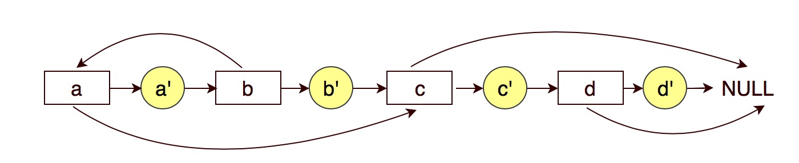

# 138. Copy List with Random Pointer


### Key idea: insert copy of each node into original list

### 核心： 把每个点的副本插入原始的list






### Solution:

1. copy next
2. copy random
3. split origin and copy


Don't modify original list when finish copy

Be careful with the case of `current.random == null`


### Python example:

```python
"""
# Definition for a Node.
class Node:
    def __init__(self, x: int, next: 'Node' = None, random: 'Node' = None):
        self.val = int(x)
        self.next = next
        self.random = random
"""

class Solution:
    def copyRandomList(self, head: 'Node') -> 'Node':
        # ege case
        if head == None:
            return None
        
        # regular case
        self.copyNext(head)
        self.copyRandom(head)
        return self.split(head)
        
    
    def copyNext(self, head):
        while head != None:
            temp = ListNode(head.val)
            temp.next = head.next
            head.next = temp
            head = head.next.next
            
    def copyRandom(self, head):
        while head != None:
            if head.random != None:
                head.next.random = head.random.next
            else:
                head.next.random = None
            head = head.next.next
            
    def split(self, head):
        dummy = ListNode(0)
        head = head.next
        dummy.next = head
        while head.next != None:
            head.next = head.next.next
            head = head.next
        return dummy.next
```


在split步骤时，在head指针挪动时，每次应该只移动一步`head = head.next`，因上面一步已经将`head.next`指向了`head.next.next`.


