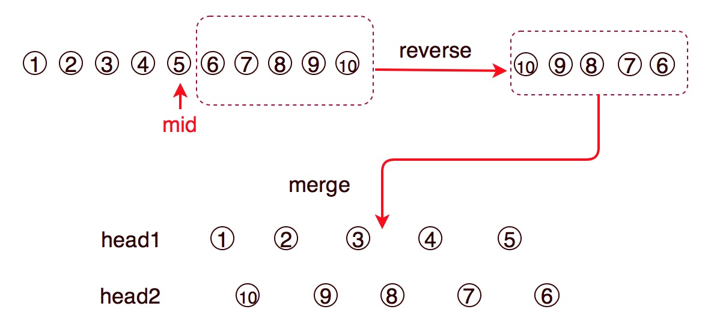
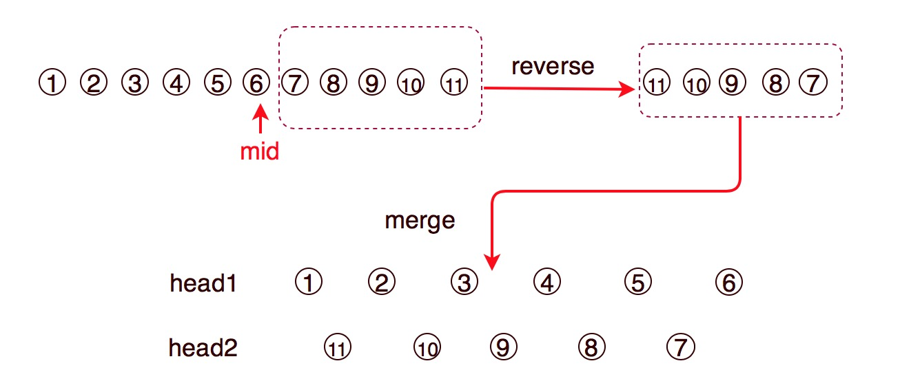

# 143. Reorder List


### Key idea: find middle + reverse latter part + merge

### 核心：快慢指针找到中间元素 ＋ 反转后半部分 ＋ 插入合并







* When searching middle node,  `faster = head.next`, `slow = head`. Pay attention to even or odd cases, which node should be middle node.
* When merging two list, should record `head1.next` and `head2.next` respectively before doing insertion.
* The condition of finishing insertion is both of head.next are null.
* 当寻找中间点时，注意list长度是基数还是偶数时，中间点应该是哪个
* 当合并两部分时，应先分别保留两个list的下一个节点，然后再插入元素
* 合并完成的条件是两个list的当前指针的下一个节点都为空


### Python example: 注意快慢指针的终止条件，慢指针指向的位置，要把两个list分开

```python
# Definition for singly-linked list.
# class ListNode:
#     def __init__(self, val=0, next=None):
#         self.val = val
#         self.next = next
class Solution:
    def reorderList(self, head: ListNode) -> None:
        """
        Do not return anything, modify head in-place instead.
        """
        # edge case
        if head == None or head.next == None:
            return 
        
        # find middle node
        fast = head.next
        slow = head
        while fast != None and fast.next != None:
            fast = fast.next.next
            slow = slow.next
# split into two lists
        temp = slow
        slow = slow.next
        temp.next = None
              
        # reverse this list from slow
        pre = None        
        while slow != None:
            temp = slow.next
            slow.next = pre
            
            pre = slow
            slow = temp
         
        # combine two lists, head and head2
        head1 = head
        temp1 = head1
        temp2 = pre
     
        while head1 != None and temp2 != None:
            temp1 = head1.next
            head1.next = temp2
            temp2 = temp2.next
            head1 = head1.next
            
            head1.next = temp1
            head1 = head1.next
            
        if head1 != None:
            head1.next = None
            
        return
```

