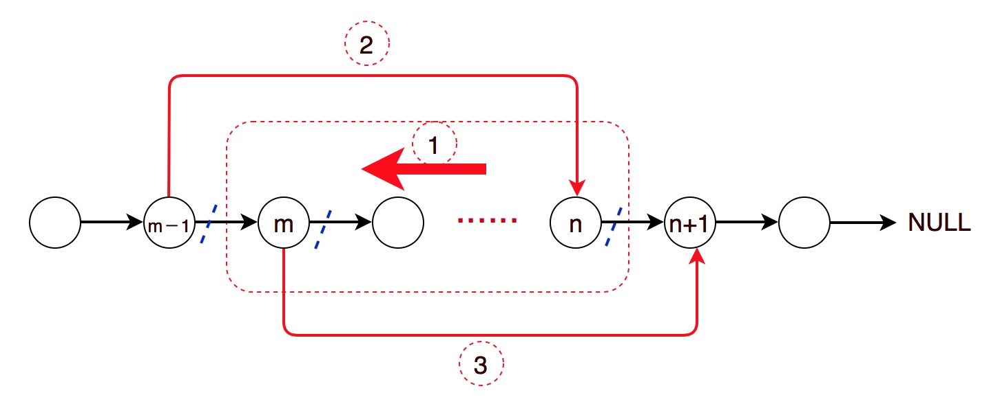

# 92. Reverse Linked List II


### Key idea: record pre-node of start, reverse from start to end, record successor of end, link pre-node and successor

### 核心： 记录第（m-1）个点，反转第m~n个点，记录第（n+1）个点，连接第（m-1）和（n+1）两个点




### Solution:

1. Record `(m-1)` element
2. Reverse from `m` to `n` 
3. Record `(n+1)` element
4. Correctly link `(m-1)` to nth and link `m`th to `(n+1)`
5. 记录第`(m-1)`个元素
6. 反转第`m`到第`n`个元素
7. 记录第`(n+1)`个元素
8. 连接`(m-1)`到`n`，连接`m`到`(n+1)`

```python
# Definition for singly-linked list.
# class ListNode:
#     def __init__(self, val=0, next=None):
#         self.val = val
#         self.next = next
class Solution:
    def reverseBetween(self, head: ListNode, m: int, n: int) -> ListNode:
        # edge case
        if m == n :
            return head
        
        dummy = ListNode(0)
        dummy.next = head
        pre = dummy
        head = dummy
        
        # find mth node
        i = 1
        while i < m:
            pre = head
            head = head.next
            i = i + 1
        
        # head is current mNode, pre is whole middle part's starting
        mNode = head
        pre = head
        head = head.next
        # reverese [m, n] nodes
        while i <= n:
            temp = head.next
            head.next = pre
            
            pre = head
            head = temp
            i = i + 1
            
        # remain part and link all finally
        nNode = head
        mNode.next.next = nNode
        mNode.next = pre
        
        return dummy.next
        
```


