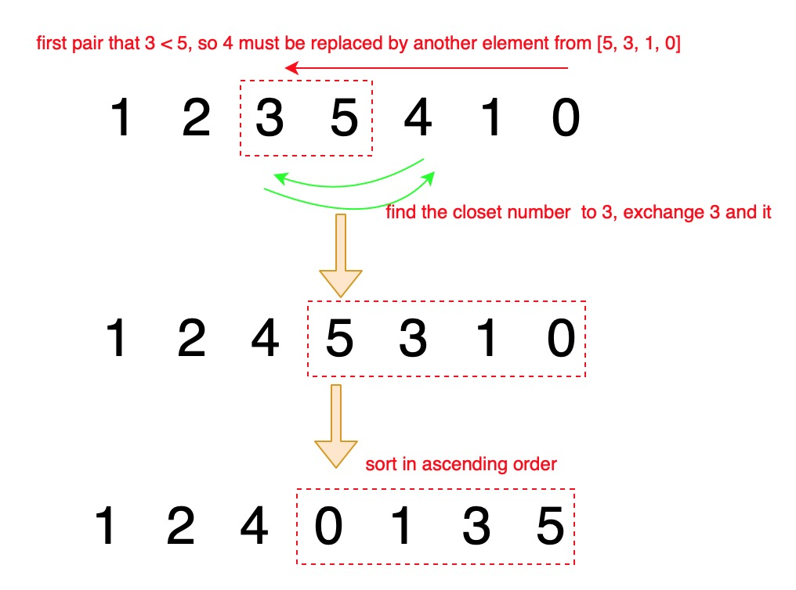

# 31. Next Permutation


找到规律就好做了

In-place sorting by bubble sort.






```python
class Solution(object):
    def nextPermutation(self, nums):
        """
        :type nums: List[int]
        :rtype: None Do not return anything, modify nums in-place instead.
        """
        # find the first pair "ab", a<b from end to start
        i = self.index(nums)
        if i == -1:
            self.sort(nums, 0)
        else:
            # find the closest number in [b:] to exchange with 'a'
            self.exchange(nums, i)
            # sort following numbers in ascending order
            self.sort(nums, i+1)
        
        
    def index(self, nums):
        for i in range(len(nums)-1, 0, -1):
            if nums[i-1] < nums[i]:
                return i-1
        return -1
            
    def exchange(self, nums, i):
        x = i+1
        for j in range(i+2, len(nums)):
            if nums[j] > nums[i] and nums[j] < nums[x]:
                x = j
        nums[i], nums[x] = nums[x], nums[i]
        
    def sort(self, nums, x):
        for i in range(len(nums)-x):
            for j in range(x, len(nums)-1):
                if nums[j] > nums[j+1]:
                    nums[j], nums[j+1] = nums[j+1], nums[j]
```



冒泡排序时间复杂度为 $$O(n^2)$$ ，所以整体时间复杂度为 $$O(n^2)$$ ，空间复杂度为 $$O(1)$$ 

