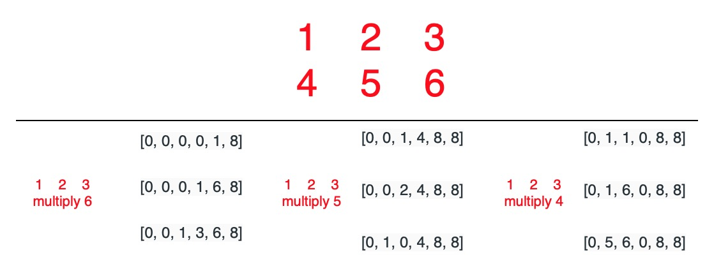

# 43. Multiply Strings


Key idea: 

1. `num1[x]*num2[y]` will occupy `result[x+y]`\(high digit\) and `result[x+y+1]`\(low digit\)
2. `num1*num2` have at most `len(num1)+len(num2)` digits.




### Solution:

1. define result list
2. multiply each pair
3. convert into string, remove high digit which is 0

```python
class Solution:
    def multiply(self, num1: str, num2: str) -> str:
        # edge case
        if num1 == 1 or num2 == 1:
            return str(num1*num2)
        
        result = [0 for i in range(len(num1)+len(num2))]
        tmp = 0
        for y in reversed(range(len(num1))):
            for x in reversed(range(len(num2))):
                multi = int(num1[y])*int(num2[x])
                multi += result[x+y+1]
                result[x+y+1] = multi%10
                result[x+y] += multi//10                    
                print(result)

        for i in range(len(result)):
            if result[i] != 0:
                break
        s = ""

        for j in range(i,len(result)):
            s += str(result[j])
        return s
```


`result` list = `[high digit, ..., low digit]`

思路不是特别难，但是要一次性写对太不容易了


Time complexity = Space complexity = $$O(n*m)$$ 

